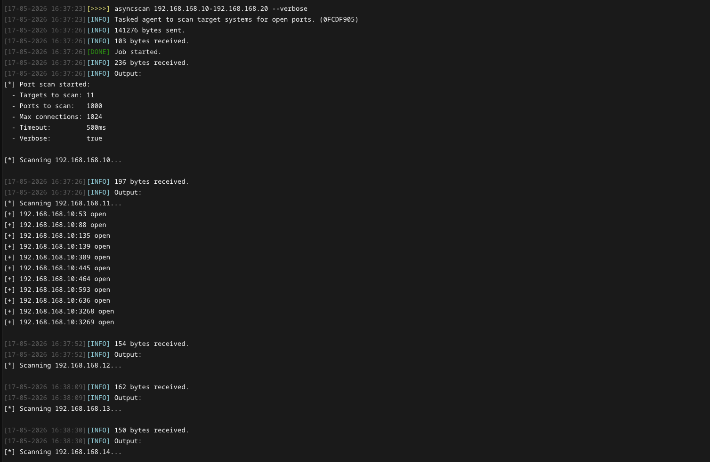
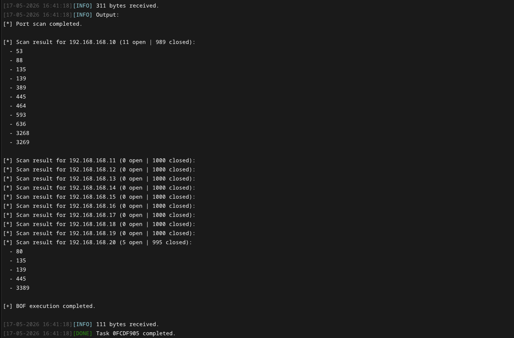

# AsyncScan

Async BOF for discovering open ports on one or more target systems. The port scan runs in the background without obstructing the agent's main thread. When `verbose` mode is enabled, open ports are reported as they are found and the `BeaconWakeup` is used to wake-up the agent from sleepmask.

>[!Important]
> This BOF requires asynchronous object file loading capabilities to work without blocking the agent. Such functionality is provided by the [Conquest](https://github.com/jakobfriedl/conquest/) framework.

## How it works

The `asyncscan` BOF involves the following steps:  

1. Comma-separated BOF arguments are parsed into a list of scan targets and ports. IP ranges and CIDR notation are expanded by the Conquest module before being passed to the BOF.
2. A pool of non-blocking TCP sockets is maintained. For each entry, the target is resolved via `getaddrinfo` and a `connect()` is fired immediately without waiting for the result.
3. `WSAPoll` waits up to a user-specified timeout for any socket in the pool to become ready. `getsockopt(SO_ERROR)` is called on each ready socket to distinguish open from closed ports.
4. Results are tracked per host. If verbose mode is enabled, open ports are printed immediately and the agent is woken up via `BeaconWakeup` to deliver output without waiting for the next check-in.
5. A final scan summary is printed after the port scan completes.

The port scan can be aborted using the `cancel` command in Conquest, or by setting the `hStop` event usign any other framework.

## Usage

The object file takes the following arguments:

| Name | Type | Description |
| --- | --- | --- |
| `targets` | `string` | Comma-separated list of resolved targets (IPs or hostnames). |
| `ports` | `string` | Comma-separated list of individual port numbers to scan. |
| `timeout` | `int` | Max time to wait per poll cycle for connections to respond, in ms.<br>**Increase** for slow or distant targets (internet, pivot chains) to avoid missing open ports.<br>**Decrease** for fast LAN targetsfor increased scanning speed. |
| `maxConn` | `int` | Number of concurrent connections maintained at one time.<br>**Increase** to scan faster at the cost of higher resource usage.<br>**Decrease** to reduce network noise or avoid overwhelming the target. |
| `verbose` | `int` | When set to `1`, open ports are reported as they are discovered. |

This repository contains a [Conquest Module](./dist/asyncscan.py) which implements the following command.

```
Usage: asyncscan <targets> [ports] [--timeout timeout] [--max-conn max-conn] [--verbose]
Example: asyncscan 192.168.168.0/24 1-1000,8443 --verbose

Required arguments:
  targets                   STRING     Comma-separated list of targets to scan. Use `-` or CIDR notation to specify IP ranges (e.g. 192.168.1.0-128,192.168.1.200,10.0.1.0/24).

Optional arguments:
  ports                     STRING     Comma-separated list of ports to check. Use `-` to specify port ranges (default: nmap top 1000).
  --timeout timeout         INT        Maximum time to wait per poll cycle for connections to respond in ms (default: 500).
  --max-conn max-conn       INT        Number of concurrent connections the port scanner maintains at one time (default: 1024).
  --verbose                 BOOL       Report open ports as they are discovered (default: false).
```

In verbose mode, open ports are printed to the agent console as they are discovered. Not supplying the `ports` argument makes the BOF scan for [nmap's top 1000](https://github.com/danielmiessler/SecLists/blob/master/Discovery/Infrastructure/nmap-ports-top1000.txt) ports by default. 



When all targets and ports have been scanned, a final scan summary shows the open ports grouped by target host.



## Installation

```
git clone https://github.com/jakobfriedl/asyncscan-bof
cd asyncscan-bof
make
```

From there, use Conquest's Script Manager to load the `dist/asyncscan.py` module and start scanning using the `asyncscan` command.
